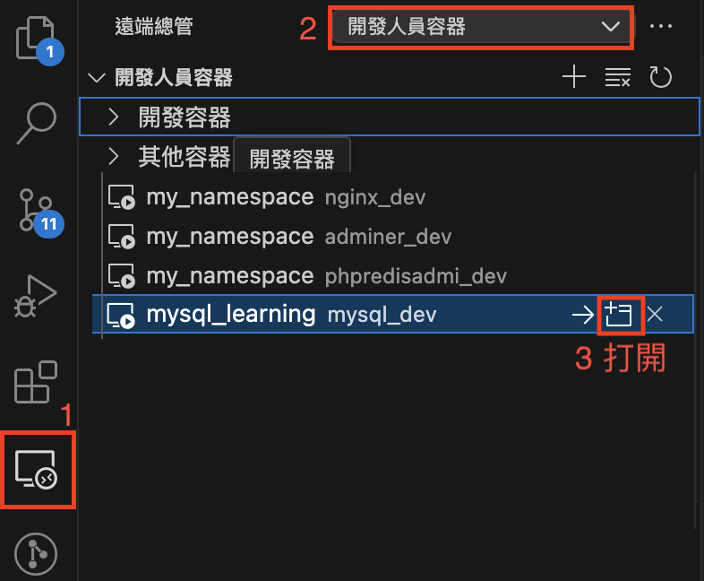

# MySQL Learning
使用 Docker Compose 建立MySQL基礎學習環境。

## 一、環境支援
- MySQL
  - mysql://localhost:3306
    - user: root
    - password: learning
  - [Adminer](http://localhost:8080)
  - [phpMyAdmin](http://localhost:8081)

## 二、流程

### 2.1 安裝依賴
- 安裝[Docker Desktop](https://www.docker.com/products/docker-desktop/)
- 安裝[Git](https://git-scm.com/downloads)
- 安裝[VS Code](https://code.visualstudio.com/)

### 2.2 拉取本環境設定
- 打開終端機，輸入下面指令
```sh
# 拉取環境設定
git clone https://github.com/marshung24/mysql-learning.git

# 進入資料夾
cd mysql-learning
```
> 會出現資料夾`mysql-learning`

### 2.3 調整環境
- 文字編輯 .env
> 可不編輯，直接使用預設值

### 手動啟動 Docker Compose
```sh
# 第一次啟動 Docker Compose - 使用 docker-compose.yaml 
docker-compose up -d

# 重新啟動 - 可以從Docker Desktop操作
docker-compose start
```
> `-d`: 背景服務模式

### 手動關閉 Docker Compose
```sh
# 關閉容器 - 可以從Docker Desktop操作
docker-compose stop

# 移除容器 - 可以從Docker Desktop操作
docker-compose down
```

### 連線至MySQL環境
#### CLI：使用 Remote SSH 連線 「開發人員容器」
1. 進入「連線總管」
2. 上方群組選擇「開發人員容器」
3. 打開目標容器 `mysql_dev`


#### GUI：Adminer
- URL: [http://localhost:8080](http://localhost:8080)

#### GUI：phpMyAdmin
- URL: [http://localhost:8081](http://localhost:8081)


## 參考資料
- [【Docker】基本介紹與安裝 Docker Desktop](https://ithelp.ithome.com.tw/articles/10340809)
- [Docker Desktop](https://docs.docker.com/desktop/)
- [Docker Images](https://github.com/marshung24/docker-images)
- [Docker LNMP](https://github.com/marshung24/Docker-LNMP-Mars)
- [Remote SSH](https://code.visualstudio.com/docs/remote/ssh)

## Log
- 20250508: Mars.Hung 建立，範本 marshung24/docker-workspace